 # Laravel Full Stack Web Application

A full-stack web application built using **Laravel (PHP)** for the backend and a modern frontend design.  
The project includes authentication, CRUD operations, and admin management features.

---

## 🚀 Features

Restaurant Booking System — Full-Stack Web Application (Laravel)
A full-stack restaurant management and table booking system built using Laravel and MySQL. The platform allows users to browse the menu, create an account, and book a table online. It includes a secure authentication system and an admin dashboard where the restaurant admin can manage bookings, approve or reject reservations, and update menu items dynamically.

Key Features & Highlights:

-User authentication (login/register) with secure session management
-Dynamic menu management by admin (add, edit, delete items)
-Table booking system with real-time admin approval
-Admin dashboard to manage users, menu items, and reservations
-Responsive UI using Blade & Bootstrap for seamless user experience
-Clean and scalable code architecture following MVC pattern

---

## 🛠️ Technologies Used

- Laravel (PHP)
- MySQL
- HTML, CSS, JavaScript
- Bootstrap
- Git & GitHub

---

## 📸 Project Screenshots

### Home Page

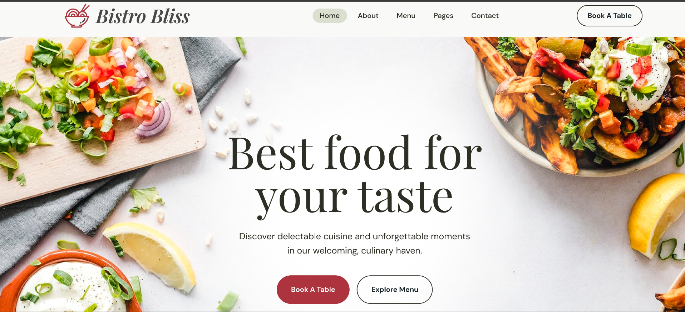
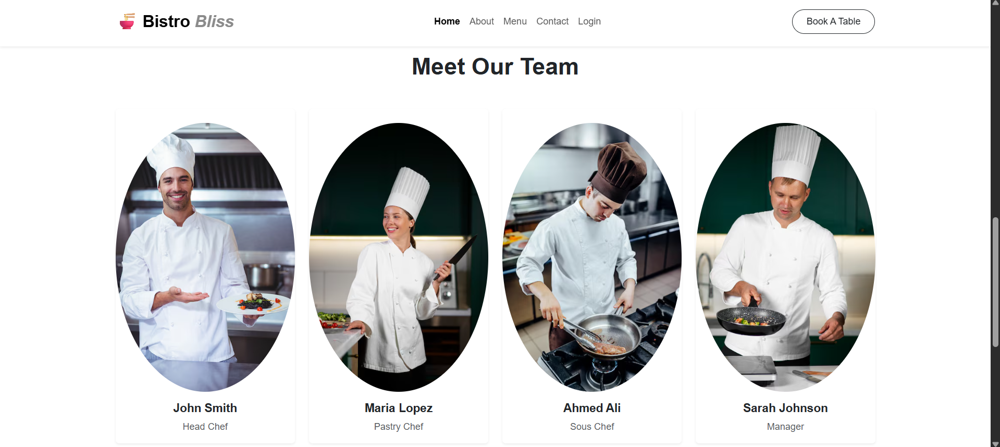

### Menu

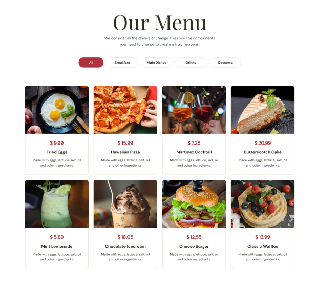
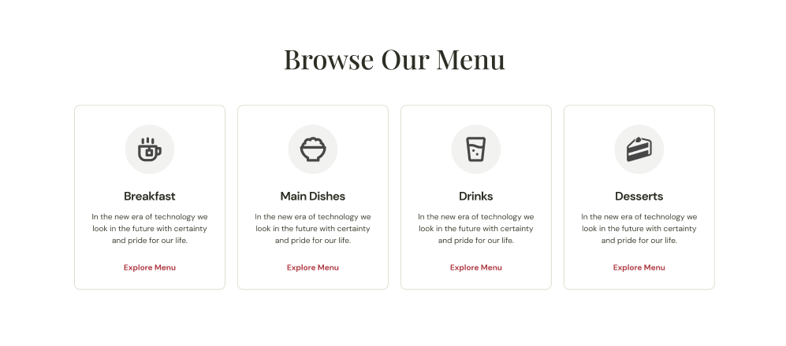
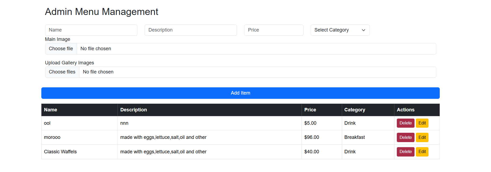

### Dashboard

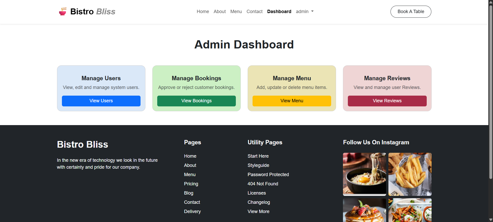

### Contact

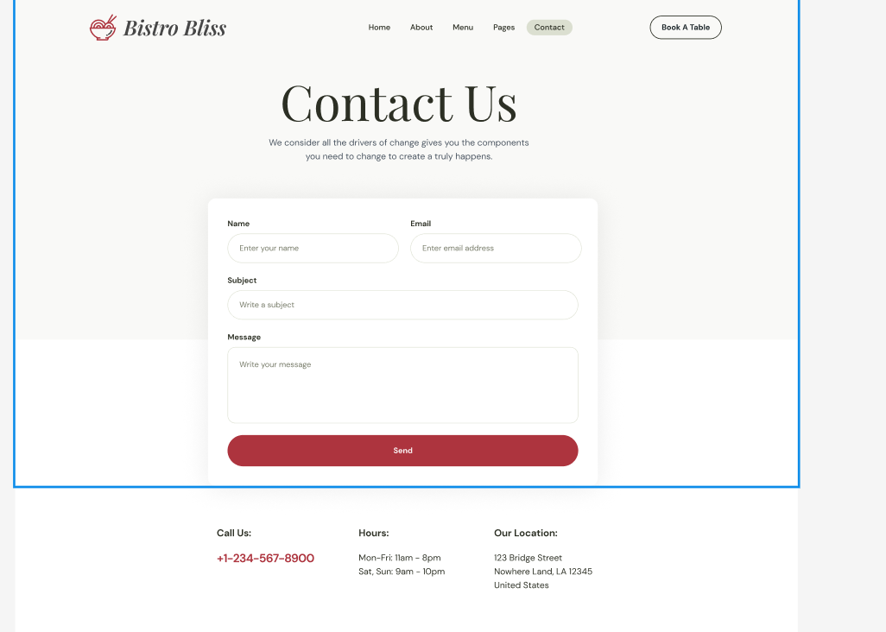

### Booking Mange

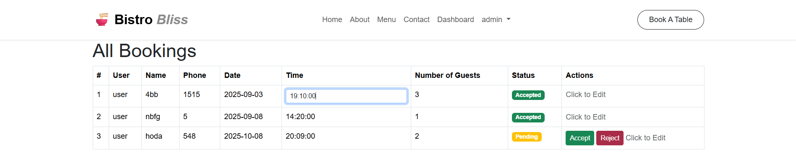

### Book A Table

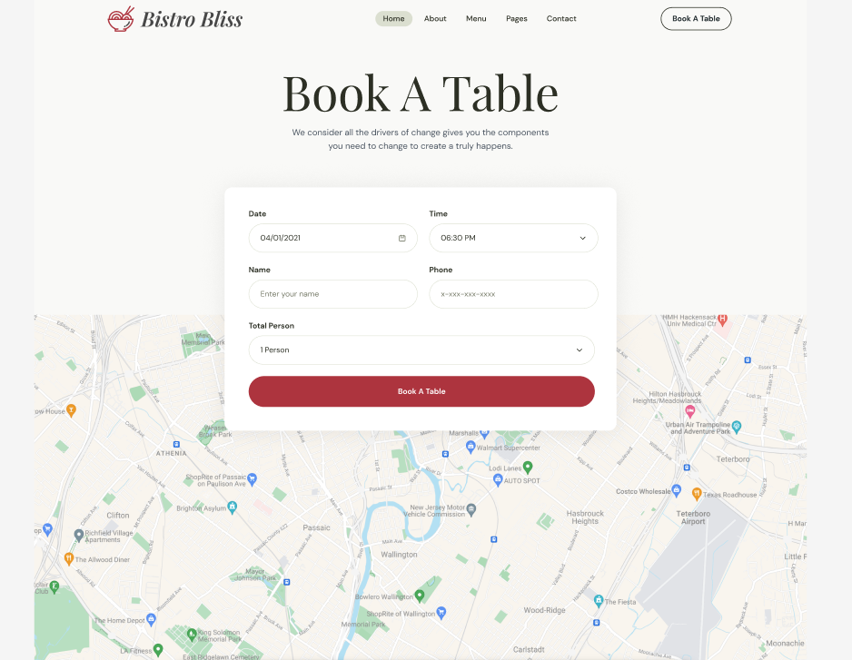

### Users Mange

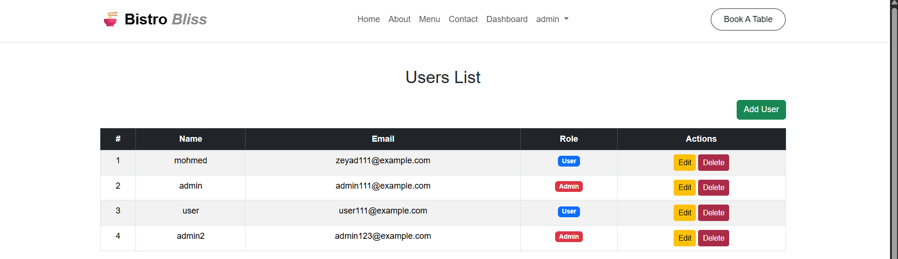

### About

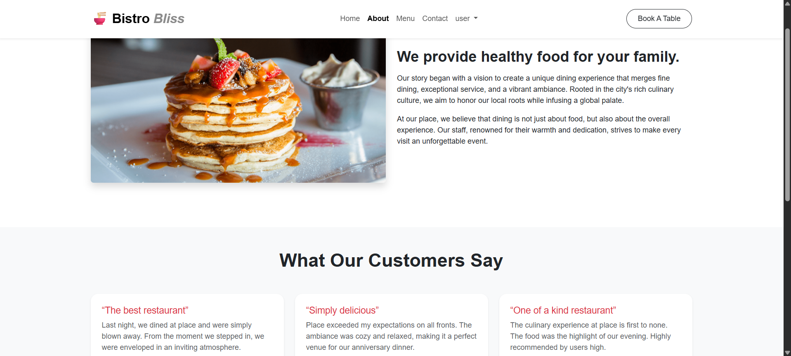

---

## ⚙️ Installation & Setup

1. Clone the repository:

```bash
git clone https://github.com/Zeyad-ashraf44/Laravel-Resturant.git
```
